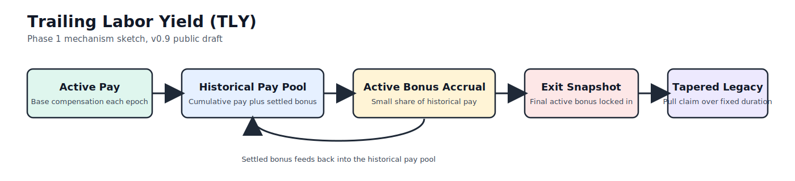

# Trailing Labor Yield (TLY)

Version: v0.9 public draft  
Status: Phase 1 publication package

This directory is a clean first-wave release package for publishing TLY to
GitHub. It is designed to make the mechanism legible quickly, show that the
idea has both economic and implementation depth, and give you ready-to-post
materials for the first public discussion cycle.

The files in `docs/` are the frozen publication copies for the `v0.9 public draft`.

If you want a repo-root README later, this file is written to be promotable.

## Quick Links

- White paper markdown:
  [docs/tly_white_paper_v0.9_public_draft.md](docs/tly_white_paper_v0.9_public_draft.md)
- PDF export source:
  [docs/tly_white_paper_v0.9_public_draft_pdf_source.md](docs/tly_white_paper_v0.9_public_draft_pdf_source.md)
- One-page summary:
  [docs/tly_one_page_summary.md](docs/tly_one_page_summary.md)
- FAQ and objections:
  [docs/tly_faq_objections.md](docs/tly_faq_objections.md)
- Diagram source notes:
  [docs/tly_visual_diagrams.md](docs/tly_visual_diagrams.md)
- Mechanism diagram:
  [assets/tly_mechanism_diagram.svg](assets/tly_mechanism_diagram.svg)
- Publish checklist:
  [PUBLISH_CHECKLIST.md](PUBLISH_CHECKLIST.md)
- GitHub setup notes:
  [GITHUB_SETUP.md](GITHUB_SETUP.md)
- Launch copy:
  [launch/hacker_news_post.md](launch/hacker_news_post.md),
  [launch/reddit_launch_posts.md](launch/reddit_launch_posts.md),
  [launch/long_form_launch_post.md](launch/long_form_launch_post.md)

## What This Package Includes

- A publication-ready white paper in Markdown.
- A PDF-friendly Markdown variant of the white paper.
- A one-page summary for founders, operators, and journalists.
- A FAQ and objections memo.
- A static mechanism diagram for GitHub, SSRN uploads, and PDF export.
- A publish checklist and GitHub setup notes.
- Draft launch copy for Hacker News, Reddit, and a longer-form post.

## What Stays In The Main Repo

The economic model and implementation remain in the main repository:

- `sim/` contains the Python simulator and Streamlit dashboard.
- `dao/` contains the EVM reference contracts and tests.

This release folder is the publication layer, not a duplicate of the full codebase.

## Phase 1 Scope

This package is aligned to the Phase 1 goal: publish cleanly and make the idea
legible.

It is intended to make you look like:

- a serious mechanism designer;
- someone with actual implementation instincts;
- someone worth paying attention to.

## Not In Scope For This Release

- product pricing;
- factory contracts;
- legal wrappers;
- audit work;
- active deployment selling.

## Recommended Publish Shape

1. Put the paper, summary, FAQ, diagram, and README into the repo in visible positions.
2. Export the PDF from the PDF-source Markdown file and commit it beside the Markdown source.
3. Use GitHub as the canonical home for the first wave.
4. Launch discussion with one Hacker News post, a few targeted Reddit posts, and one longer-form post.

See [RELEASE_MANIFEST.md](RELEASE_MANIFEST.md) for the exact contents of this package.
