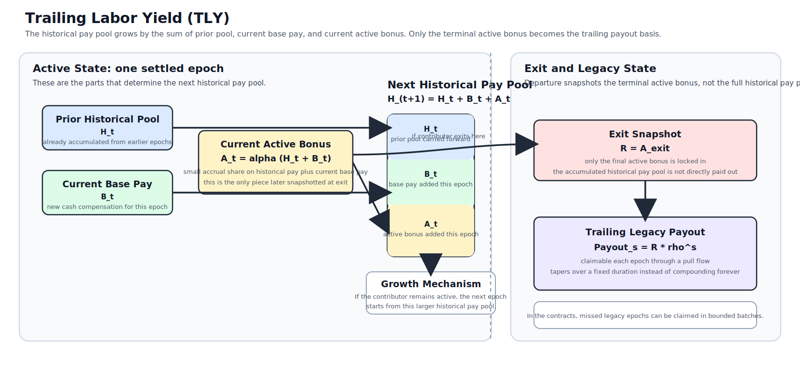

# Trailing Labor Yield (TLY)

Version: v0.9 public draft  
Status: mechanism design proposal

Trailing Labor Yield (TLY) is a stablecoin-denominated contributor
compensation mechanism for DAOs, protocol companies, cooperatives, and other
treasury-backed organizations. It combines normal active pay, a small
compounding active bonus tied to historical pay, and a tapering trailing payout
after exit.

This repository is the Phase 1 public-release layout: the white paper and
supporting documents are up front, while the simulator and EVM reference
implementation remain visible and close at hand.

## Start Here

- White paper:
  [paper/tly_white_paper_v0.9_public_draft.md](paper/tly_white_paper_v0.9_public_draft.md)
- PDF export source:
  [paper/tly_white_paper_v0.9_public_draft_pdf_source.md](paper/tly_white_paper_v0.9_public_draft_pdf_source.md)
- One-page summary:
  [paper/tly_one_page_summary.md](paper/tly_one_page_summary.md)
- FAQ and objections:
  [paper/tly_faq_objections.md](paper/tly_faq_objections.md)
- Simulator:
  [sim/app.py](sim/app.py)
- Solidity contracts:
  [dao/contracts/ContributorRegistry.sol](dao/contracts/ContributorRegistry.sol)
  and
  [dao/contracts/TreasuryDistributor.sol](dao/contracts/TreasuryDistributor.sol)

## Repository Layout

- `paper/`
  - public white paper
  - PDF-friendly export source
  - one-page summary
  - FAQ and objections
  - mechanism diagram and publication graphics
- `sim/`
  - Python simulator and Streamlit entrypoint
- `dao/`
  - EVM reference contracts, Foundry config, and tests
- `release/phase1_v0.9_public_draft/`
  - publication checklist, GitHub setup notes, release manifest, and launch copy

## What This Release Is Trying To Do

Phase 1 is deliberately narrow:

- publish cleanly;
- make the mechanism legible quickly;
- show both economic and implementation seriousness;
- invite criticism before commercialization.

## Not In Scope For This Release

- product pricing;
- factory contracts;
- legal wrappers;
- audit work;
- deployment sales.

## Notes

- The canonical publication draft is `v0.9 public draft`.
- The PDF binary is not checked in yet; export instructions live at
  [release/phase1_v0.9_public_draft/PDF_EXPORT.md](release/phase1_v0.9_public_draft/PDF_EXPORT.md).
- The simulator and Solidity code here are reference implementations for the
  mechanism, not production-ready audited systems.
