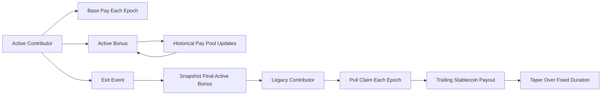
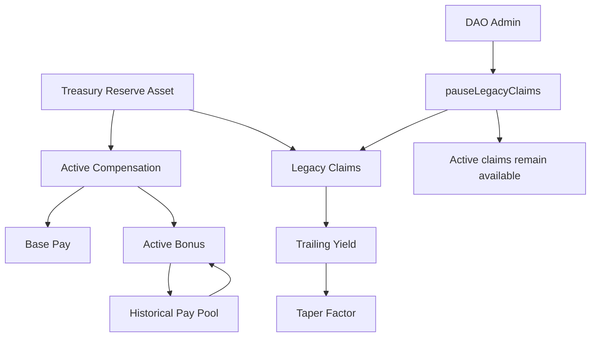
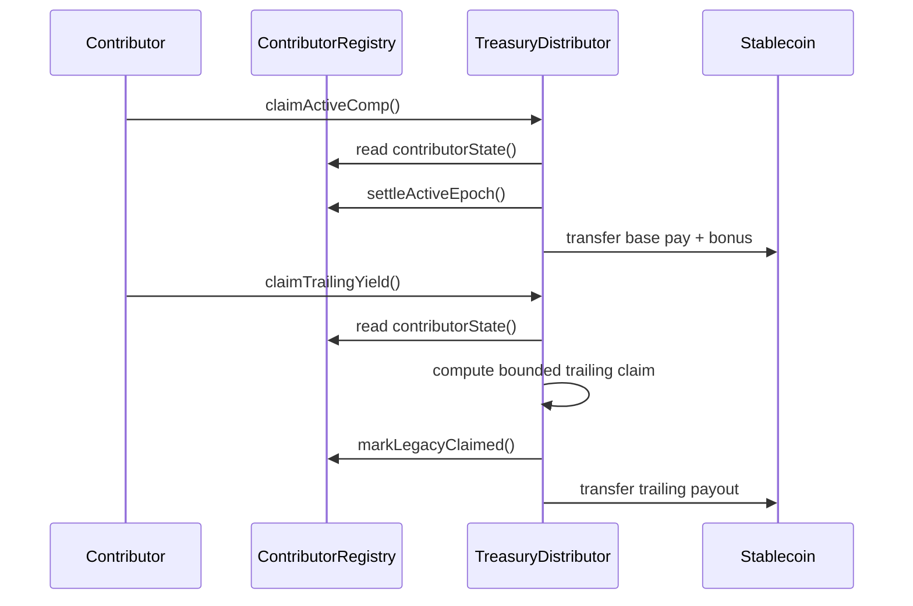
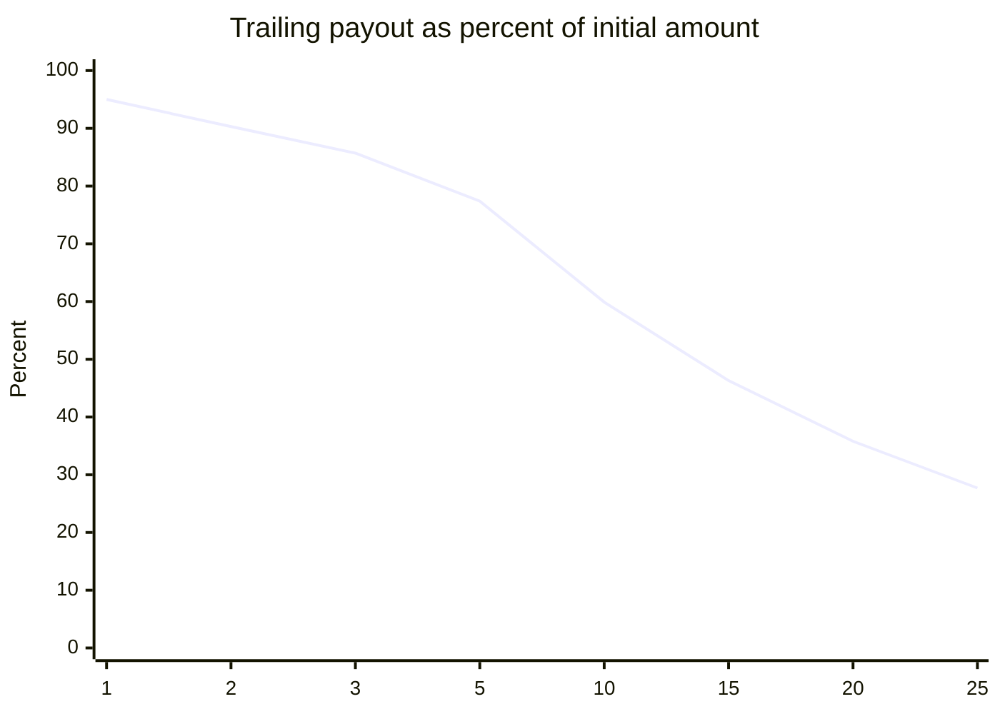
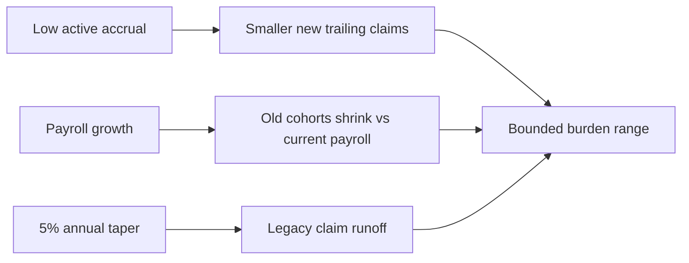

# TLY Visual Diagrams

Version: v0.9 public draft  
Companion graphics for the TLY white paper

These diagrams are intended for GitHub, Mirror, and publication decks. Mermaid
rendering support varies by platform; export diagrams to SVG or PNG before
using them in static PDFs.

## 1. Contributor State Flow

## 2. Organization Cash-Flow Schematic

## 3. Pull-Claim Architecture

## 4. Taper Curve Example

For an initial trailing amount of $3,500 and a 5 percent annual taper:

| Year | Payout | Relative to initial amount |
| ---: | ---: | ---: |
| 1 | $3,325.00 | 95.0% |
| 2 | $3,158.75 | 90.3% |
| 3 | $3,000.81 | 85.7% |
| 5 | $2,708.23 | 77.4% |
| 10 | $2,095.58 | 59.9% |
| 15 | $1,621.52 | 46.3% |
| 20 | $1,254.70 | 35.8% |
| 25 | $970.86 | 27.7% |

## 5. Mechanism Comparison Chart

| Feature | Equity | DAO token comp | Pension | Revenue share | TLY |
| --- | --- | --- | --- | --- | --- |
| Liquid while active | Low | High | Low | Medium | High for active pay |
| Governance dilution | Often | Direct | None | None | None |
| Treasury cash obligation | Low near term | Indirect | High | High | High but bounded |
| Long-run liability bounded | By equity pool | By issuance policy | Often weak | Contract-specific | Taper and term |
| Market-price dependence | High | High | Low | Medium | Low if stablecoin paid |
| Treasury-solvency dependence | Indirect | Indirect | High | High | High |
| Best fit | Venture startups | Token networks | Mature employers | Revenue assets | Treasury-backed labor systems |

## 6. Burden Logic

